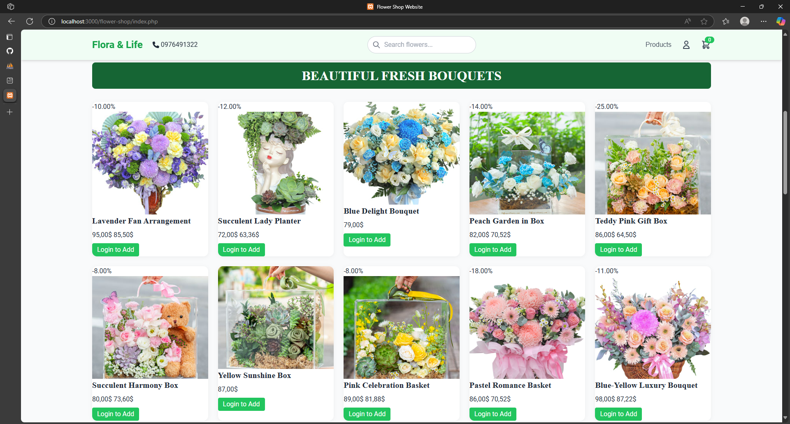
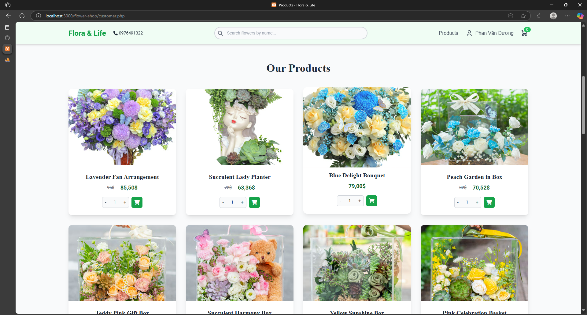
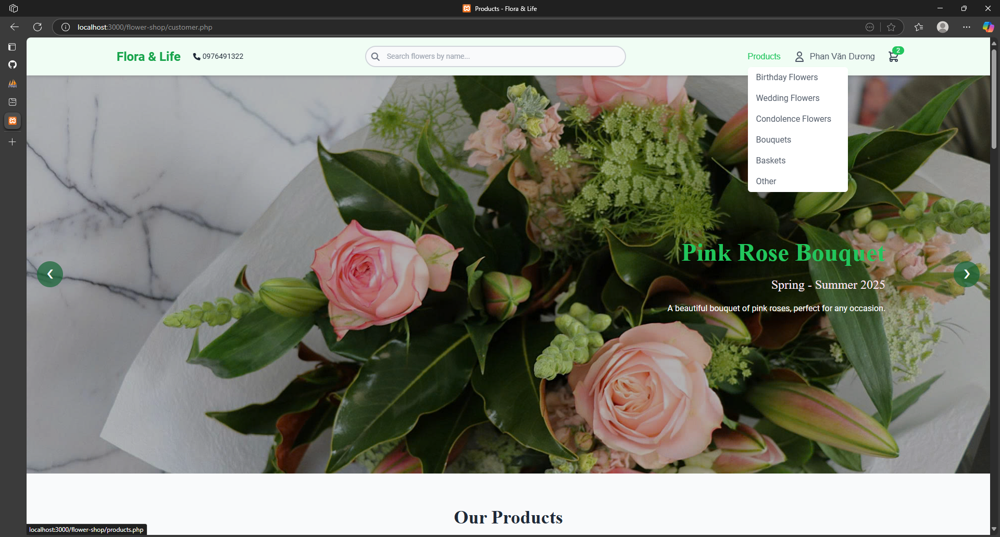
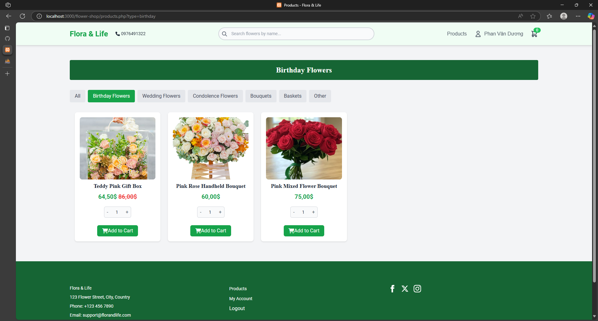
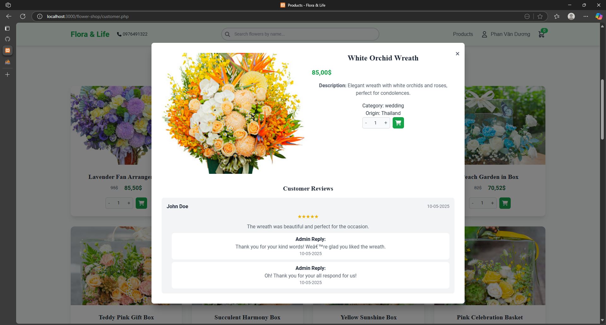
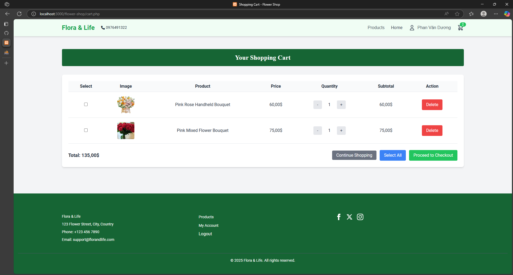
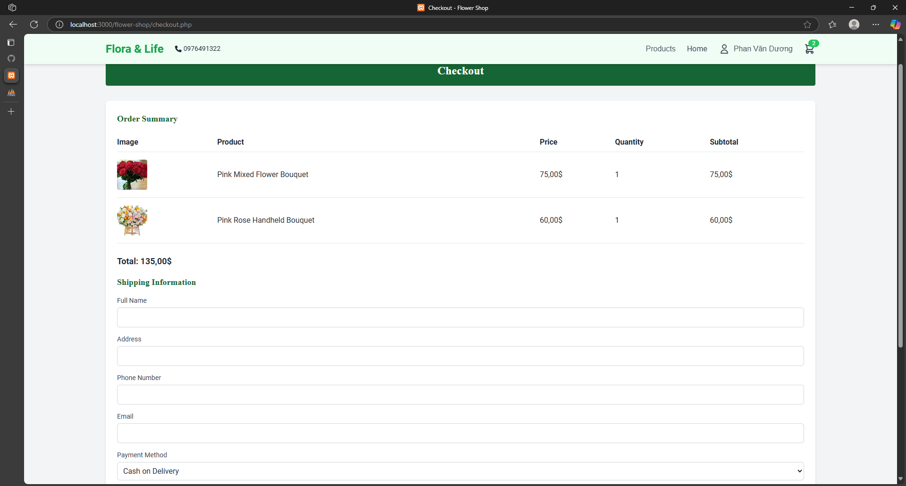
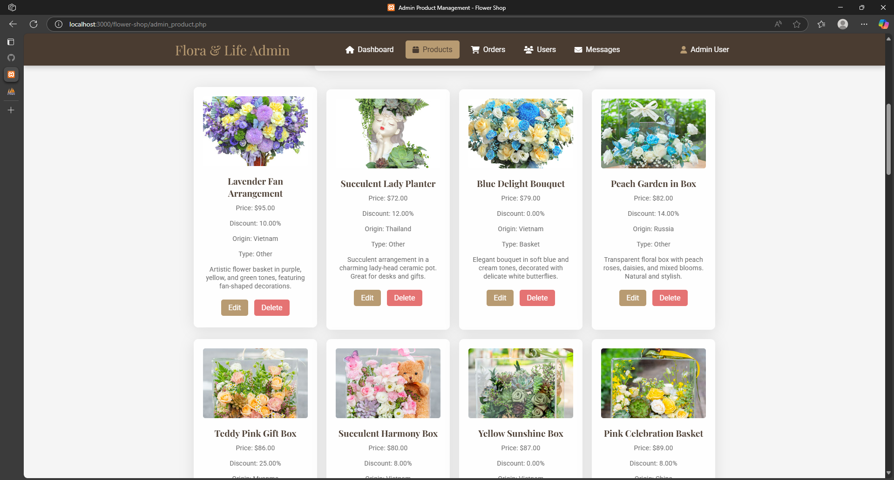
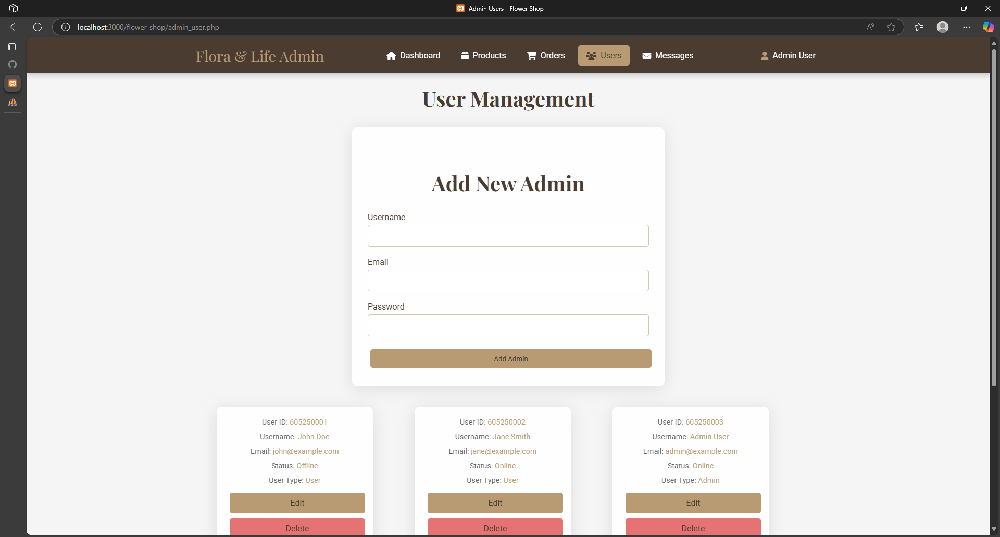
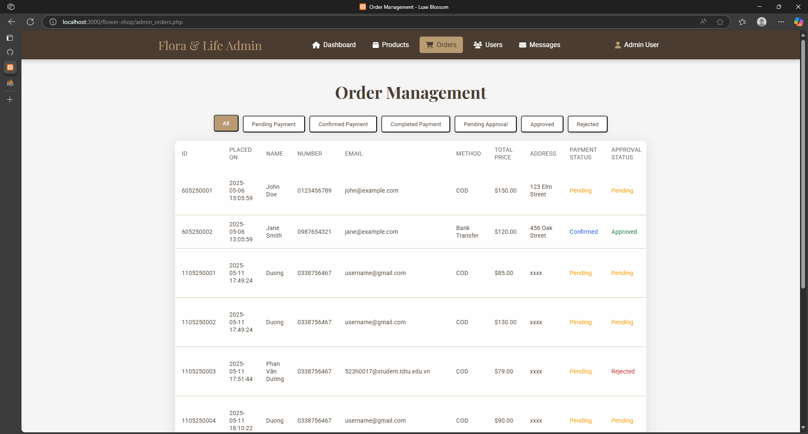

# 🌸 Flower Shop Web Application

Welcome to the **Flower Shop Web Application** — a complete e-commerce platform where users can browse, purchase, and manage flower orders online. The system includes both customer-facing and admin-facing functionality, offering a seamless flower shopping experience.

---

## 📚 Table of Contents

- [Project Overview](#project-overview)
- [Key Features](#key-features)
- [Screenshots](#screenshots)
- [Installation](#installation)
- [Usage & Examples](#usage--examples)
- [Dependencies](#dependencies)
- [Contributing](#contributing)
- [Troubleshooting & FAQ](#troubleshooting--faq)
- [Support](#support)
- [Acknowledgements](#acknowledgements)
- [References](#references)
- [License](#license)
- [Changelog](#changelog)
- [Known Issues](#known-issues)

---

## 📖 Project Overview

This project is a web-based flower shop where users can:

- Sign up and log in
- Browse flower arrangements by category (birthday, wedding, sympathy, etc.)
- Add items to cart and place orders
- View past orders and track order status

Admins have access to a control panel to manage:

- Products
- User accounts
- Orders

The application is built using **PHP**, **MySQL**, **Bootstrap**, and **JavaScript**, and is designed for deployment on a local or shared hosting environment.

---

## 🌟 Key Features

- ✅ User Registration & Login
- ✅ Responsive Homepage with Featured Products
- ✅ Product Categories & Search
- ✅ Shopping Cart with Quantity Control
- ✅ Order Management for Customers
- ✅ Admin Dashboard (Product, Order, User Management)
- ✅ Bootstrap-based UI for responsiveness
- ✅ Session Management with PHP

## 🛠️ Installation

Follow these steps to set up the project locally:

### 1. Clone the Repository

```bash
git clone https://github.com/Tick2005/Flower-shop.git
cd flower-shop
```

### 2. Database Setup

- Open phpMyAdmin on your localhost and import the flower_db.sql file.
- Alternatively, you can copy and add the SQL code in the file named SQL near the Database.

### 3. Configure Database Connection

In file connection.php, update your database credentials:

```bash
    $host = 'localhost';
    $user = 'root';
    $password = '';
    $database = 'flower_db';
```

### 4. Start Local Server

- Open XAMPP and start Apache and SQL
- Navigate http://localhost/flower-shop/index.php to view contribution page.

## 🧪 Usage & Examples

### Contribution page : index.php

In here, you can see such as: view product , about for us, and list product is interested by all customer for us.



- If you want order or add product to cart , you should click on user icon to login account.
- And if you don't have account you can navigate from login page to regidter page by click on "Register here".

### Homepage

- After login, you in homepage displays featured products and categories.


  
### Product Browsing

- Users can browse products by category (e.g., Birthday Flowers, Wedding Flowers).




- Each product card displays the product image, name, price, and a button to add to the cart.




### Shopping Cart

- Users can view their cart, adjust quantities, and remove items.
- The total price is calculated based on the items in the cart.




### Checkout Process

- Users can proceed to checkout, fill in their shipping information, and select a payment method.



### Admin Dashboard

- Admins can manage products, view orders, and handle user accounts.
- The dashboard provides insights into sales and user activity.
  




## 🤝 Contributing

We welcome contributions to the Flower Shop Web Application! To contribute, please follow these steps:

1. **Fork the Repository**: Click on the "Fork" button at the top right of the repository page.
2. **Clone Your Fork**: Clone your forked repository to your local machine.
   ```bash
   git clone https://github.com/your-username/Flower-shop.git
   cd Flower-shop
   ```
3. **Create a New Branch**: Create a new branch for your feature or bug fix.
   
   ```bash
   git checkout -b feature/YourFeature
   ```
4. **Make Your Changes**: Implement your changes and test them thoroughly.
5. **Commit Your Changes**: Commit your changes with a descriptive message  
```bash
git commit -m 'Add some feature'
```
7. Open a Pull Request: Go to the original repository and click on "New Pull Request." Select your branch and submit the pull request.

## 📦 Dependencies

- PHP: Server-side scripting language.
- MySQL: Database management system.
- Bootstrap: Front-end framework for responsive design.
- PHPMailer: Library for sending emails.


## 🛠️ Troubleshooting & FAQ

- Q: What if I encounter a database connection error?

    + A: Ensure your database credentials in connection.php are correct and that the MySQL server is running.
- Q: How do I reset my password?

    + A: Use the "Forgot Password" feature on the login page to reset your password.

 ## 📞 Support

For support, please contact us at the following email addresses:

- 523H0017@student.tdtu.vn
- 523H002@student.tdtu.edu.vn
- 523H0025@student.tdtu.edu.vn
- 523H0035@student.tdtu.edu.vn
- 523H0074@student.tdtu.edu.vn

We are here to help you with any questions or issues you may have regarding the Flower Shop Web Application.

## 📚 References

- [PHP Documentation](https://www.php.net/docs.php) - Official documentation for PHP, including tutorials and function references.
- [MySQL Documentation](https://dev.mysql.com/doc/) - Comprehensive guide to MySQL, covering installation, configuration, and SQL syntax.
- [Bootstrap Documentation](https://getbootstrap.com/docs/) - Official Bootstrap documentation, providing examples and guidelines for using the framework.

## 📝 License

This project is licensed under the MIT License - see the LICENSE file for details.

## 📅 Changelog

v1.0 - Initial release with core features.

## ⚠️ Known Issues
Some users may experience issues with email notifications; ensure your SMTP settings are correctly configured.
